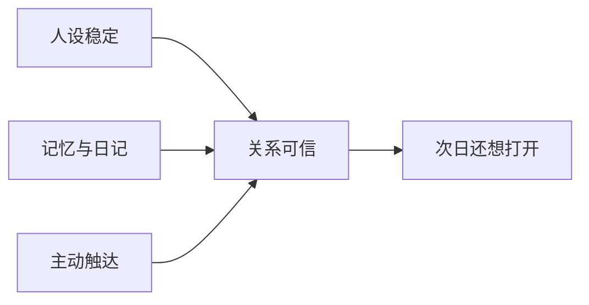
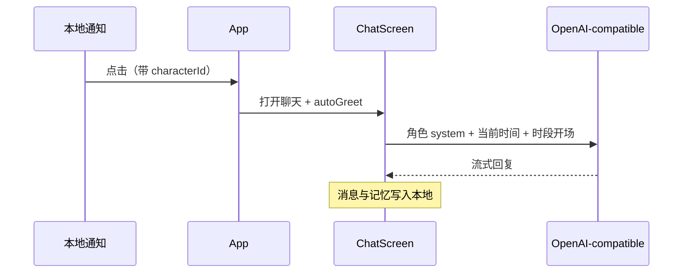

# 💖 心动伴侣 — AI Social Companion

## 🌸 一个“会在意你”的 AI 关系产品

<p align="center">
  
</p>

<p align="center">
  <a href="https://brocademaple.github.io/bcmp_cyber_lover/"></a>
  <a href="https://github.com/brocademaple/bcmp_cyber_lover"></a>
  
  
  
  
</p>

> 心动伴侣是一款以“长期关系体验”为核心的 AI 社交应用。它不只回答问题，而是通过角色人设、记忆沉淀、主动触达与情绪反馈，持续建立“被理解、被记住、被惦记”的体验。

> 🌐 项目展示页（GitHub Pages）：**[https://brocademaple.github.io/bcmp_cyber_lover/](https://brocademaple.github.io/bcmp_cyber_lover/)**

| 🔗 入口 | 地址 |
|:---|:---|
| 项目展示站 | [brocademaple.github.io/bcmp_cyber_lover](https://brocademaple.github.io/bcmp_cyber_lover/) |
| 更新日志页 | [docs/changelog.html](https://brocademaple.github.io/bcmp_cyber_lover/changelog.html) |
| 仓库地址 | [github.com/brocademaple/bcmp_cyber_lover](https://github.com/brocademaple/bcmp_cyber_lover) |

| | |
|:---|:---|
| **定位** | 安卓优先的 AI 虚拟伴侣 —— 用**持续对话 + 本地记忆 + 定时触达**模拟「她记得你、会来找你」的关系感 |
| **一句话** | 不是更会答题的 Chatbot，而是能**陪你聊下去、人设不漂、数据留在你手机里**的轻量关系型客户端 |
| **技术底座** | React Native · Expo ~54 · 任意 **OpenAI-compatible** API|

---

## 产品叙事：我们在优化什么？



| 维度 | 普通 AI 工具 | 本项目的取舍 |
|:---|:---|:---|
| 成功标准 | 答对、答全 | **像同一个人、有温度、有回访理由** |
| 记忆 | 可选 | **角色档案 + 消息持久化 +（Admin）日/周/月记** |
| 界面 | 功能堆满 | **MVP 主路径极简**；高级能力进设置或保留在代码层 |

---

## 当前版本：主路径上你能玩到什么

| 模块 | 能力 | 说明 |
|:---|:---|:---|
| **Onboarding** | 3 步上手 | 选角 → 填 API Key → 注册每日通知（默认 20:00） |
| **首页** | 横滑选角 | 多角色「橱窗感」切换，进入对应聊天 |
| **聊天** | 流式回复 · 发图 | SSE 打字感；支持图片（视觉模型） |
| **快捷回应** | 5 + 1 | 底部一键短语降低「不知道聊什么」的摩擦 |
| **角色档案** | 从聊天页进入 | 档案 / 记忆 / 纪念日；（**Admin** 下多一个 **角色日记** 页签） |
| **每日提醒** | 本地通知 | 文案按角色人设预写；点击进聊天并触发 **AI 生成当日开场白** |
| **设置 · 探索 / Admin** | 双模式 | 见下表 |
| **隐私** | Key 加密 | API Key 走 `expo-secure-store`；聊天记录与角色数据本地存储 |

### 探索模式 vs Admin 模式

| | **探索模式**（默认） | **Admin 模式** |
|:---|:---|:---|
| 目标用户 | 想纯聊天、少配置 | 创作者 / 开发者 / 想验记忆与日记的人 |
| 角色编辑 | 隐藏 | **编辑角色**入口开启 |
| 角色日记 | 隐藏 | **日 / 周 / 月记**可见，便于看长期聚合 |
| 虚拟时间 | — | **±小时 / 天 / 周 / 月** 快进快退，验证记忆与 rollup **无需真等** |

> 视频通话、高级记忆参数、主题切换等 **仍在仓库中，UI 入口已收敛**；需要时可直接恢复导航，可结合下方「仓库地图」快速定位代码。

---

## 角色阵容（内置三人）

人设与 `systemPrompt` 集中在 `src/store/chatStore.ts`，可按产品迭代继续打磨。

| 角色 | 气质标签 | 你在产品上要感知到的「钩子」 |
|:---|:---|:---|
| **鹿芽** | 元气 · 室友型互怼 | 短句、黏人、先共情再逗你 |
| **纪遥** | 慢热 · 倾听型笔友 | 留白多、适合深夜长聊 |
| **凛夜** | 毒舌 · 外冷内热 | 嘴硬心软，每轮都藏一点在意 |

---

## 关系体验链路（从通知到模型）



**小巧思（实现层）**：`buildSystemMessage` 里注入 **口头禅、当前时间、统一回复规范**（如控制句长），减少「像客服」的漂移；Admin **模拟时钟** 与日记 key 对齐，方便验边界日。

---

## 快速开始

```bash
npm install
npx expo start
# 安卓真机/模拟器
npx expo start --android
```

| 构建 | 命令 |
|:---|:---|
| EAS APK | `npm i -g eas-cli` → `eas login` → `eas build --platform android --profile preview` |

---

## 接入模型（3 步）

1. **设置 → 服务提供商**：选硅基流动 / DeepSeek / 自定义 Base URL  
2. 填入 **API Key**，选 **文字模型**（如 `Qwen/Qwen2.5-72B-Instruct`）及可选 **视觉模型**  
3. **测试连接** 后保存（Onboarding 里也会写入 Key）

---

## 技术栈速览

| 层 | 选型 |
|:---|:---|
| 框架 | React Native 0.81 · Expo ~54 · TypeScript |
| 状态 | Zustand（`chatStore` / `settingsStore`） |
| 导航 | React Navigation 6 |
| 持久化 | AsyncStorage + SecureStore（Key） |
| AI | `aiService.ts` 统一流式与多模态请求 |
| 通知 | `expo-notifications`（每日定时 + 点击路由） |

---

## 仓库地图（读代码从哪下嘴）

```
src/
├── store/           chatStore（角色、消息、日记生成）
│                    settingsStore（模式、服务、生命、Admin 时间）
├── services/        aiService · notificationService · diaryService · …
├── screens/         Onboarding · Home · Chat · Settings · …
├── navigation/      AppNavigator
└── types/           Character · Message · CharacterDiary · …
```

**进阶阅读建议**：结合 `store / services / screens` 目录，从消息流、记忆存储、通知唤回三条主链路入手。

---

## 已知缺口（诚实版 Roadmap 提示）

| 项 | 状态 |
|:---|:---|
| 设置里 **修改每日通知时刻**（Picker + 重新 `schedule`） | UI 占位，逻辑待接 |
| Onboarding **保存前** 调通一次 API | 建议补强，减少「进了聊天才报错」 |

---

<p align="center">
  <b>心动伴侣</b> — 把「关系」拆成可迭代模块：人设 · 记忆 · 触达 · 双模式验证。<br/>
  <sub>欢迎 fork 换皮、换模、做自己的长期陪伴实验。</sub>
</p>
