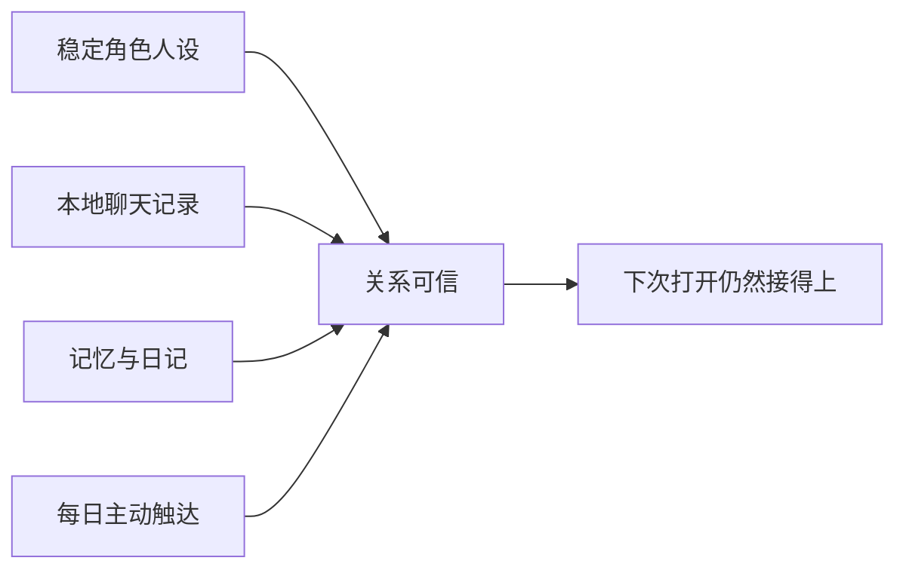

# 心动伴侣 HeartBeat Companion

一个以长期陪伴、稳定人设和本地记忆为核心的 AI 关系产品。

<p align="center">
  <a href="https://brocademaple.github.io/bcmp_cyber_lover/">
    
  </a>
</p>

<p align="center">
  <a href="https://brocademaple.github.io/bcmp_cyber_lover/"></a>
  <a href="https://github.com/brocademaple/bcmp_cyber_lover"></a>
  
  
</p>

## 现在的版本：V1.5

V1.5 将产品收束为“可信伴侣 + 角色创作”。角色拥有可修正的长期记忆、可回看的关系时间线和不会覆盖共同经历的人设版本；用户也可以从空白角色开始，用简单模式生成结构化规则，或进入专家模式逐层调整 Prompt。

当前展示站主视觉是用脚本合成的粉色记忆墙：中央是鹿芽，四周是聊天、漫画、便利店灯光和睡前提醒的碎片。它已经接入 GitHub Pages 首页，也同步放进 README 顶部。

| 入口 | 地址 |
|:---|:---|
| 项目展示站 | [brocademaple.github.io/bcmp_cyber_lover](https://brocademaple.github.io/bcmp_cyber_lover/) |
| 更新日志页 | [brocademaple.github.io/bcmp_cyber_lover/changelog.html](https://brocademaple.github.io/bcmp_cyber_lover/changelog.html) |
| 仓库地址 | [github.com/brocademaple/bcmp_cyber_lover](https://github.com/brocademaple/bcmp_cyber_lover) |

## 产品方向


```mermaid
flowchart LR
  A[稳定角色人设] --> R[关系可信]
  B[本地聊天记录] --> R
  C[记忆与日记] --> R
  D[每日主动触达] --> R
  R --> E[下次打开仍然接得上]
```

| 维度 | 当前取舍 |
|:---|:---|
| 角色 | 鹿芽、纪遥、凛夜三位内置角色，强调不同陪伴语气 |
| 聊天 | OpenAI-compatible API，支持流式回复和视觉模型 |
| 记忆 | 聊天记录、角色关系数据、日记和纪念日都走本地持久化；长期记忆可修正、锁定和删除 |
| 触达 | 每日通知进入聊天，并可生成当日开场白 |
| 创作 | 自定义角色、简单/专家模式、本地质量体检和角色定义版本回退 |
| 验证 | Admin 模式支持虚拟时间；V1.5 另有伴侣与角色创作链路验收脚本 |

## 当前可玩路径

| 模块 | 能力 |
|:---|:---|
| Onboarding | 选角色、配置 API Key、注册每日通知 |
| 首页 | 陪伴空间，展示角色状态和进入聊天的主入口 |
| 聊天 | 流式回复、图片输入、快捷回应 |
| 角色档案 | 档案、记忆、纪念日，Admin 下可看角色日记 |
| 角色创作 | 新建自定义角色，简单生成或专家编辑，保存前体检，支持版本回退 |
| 设置 | 服务提供商、模型、主题、通知、Admin 虚拟时间 |
| 本地数据 | API Key 加密保存；聊天和角色保存在本机；支持本地备份、恢复前快照和错误诊断 |

## 角色阵容

| 角色 | 气质 | 产品钩子 |
|:---|:---|:---|
| 鹿芽 | 元气、室友型、会催你吃饭 | 用日常小事制造“她记得我”的感觉 |
| 纪遥 | 慢热、安静、像雨夜笔友 | 适合长聊、留白和情绪承接 |
| 凛夜 | 嘴硬、外冷内热 | 轻微互怼里藏着在意 |

## 快速开始

```bash
npm install
npx expo start
npx expo start --android
```

接入模型：

1. 打开 app 的“设置 / 服务提供商”
2. 选择硅基流动、DeepSeek 或自定义 OpenAI-compatible Base URL
3. 填入 API Key、文字模型和可选视觉模型
4. 测试连接后保存

本地开发也可以通过 `.env.local` 注入 DeepSeek：

```bash
EXPO_PUBLIC_DEEPSEEK_API_KEY=sk-...
npm run verify:deepseek-config
npx expo start
```

未保存过本机密钥时，应用会默认选择 DeepSeek、`deepseek-chat` 和 `https://api.deepseek.com/v1`；保存过服务配置后，以本机安全存储里的设置为准。

## GitHub Pages 首图

首图不是一次性生成的大图，而是由脚本拼接合成：

```bash
npm run build:pages-hero
```

相关文件：

| 文件 | 用途 |
|:---|:---|
| `scripts/build-cyberlover-hero.mjs` | 生成粉色记忆墙首图 |
| `docs/assets/cyberlover-home-hero.webp` | GitHub Pages 首页首屏 poster，3200 x 1600 |
| `docs/assets/cyberlover-home-hero-preview.webp` | README 和社交预览图，1920 x 960 |
| `docs/index.html` | GitHub Pages 首页 |

## 验证命令

```bash
npx tsc --noEmit
npm run verify:deepseek-config
node scripts/verify-chat-history-ordering.js
npm run verify:debug-now
npm run verify:visual-assets
npm run verify:v1.5
npm run build:web
```

这些检查覆盖类型、聊天历史排序、旧数据恢复、虚拟时间进入 AI prompt、角色视觉素材注册表、文档素材镜像、V1.5 记忆/关系/角色创作链路和 Expo Web 导出。涉及聊天、存储、AI 回复、设置行为、角色图、图标、文档展示或页面布局时，提交前应跑一遍。

完整版本目标、交付进度和 API 支持清单见 [V1.5 项目管理文档](./docs/project-management/heartbeat-companion-v1.5.md)。

## 仓库地图

```text
src/
├── store/           chatStore, settingsStore
├── services/        aiService, chatPersistence, diaryService, notificationService
├── screens/         Home, Chat, Settings, Onboarding
├── components/      ChatBubble, MessageInput, ThemeArtworkLayer
├── navigation/      AppNavigator
└── utils/           chatHistory, theme, colors

docs/
├── index.html       GitHub Pages 首页
├── styles.css       展示站样式
└── assets/          首图、角色图、记忆漫画
```

## 已知缺口

| 项 | 状态 |
|:---|:---|
| 设置里修改每日通知时刻 | 已接入：改时间会重新排程，关闭会取消，重新开启会按当前时刻排程 |
| Onboarding 保存前调通一次 API | 已接入：连接成功后才保存配置 |
| 语音输入 | 待接 Speech-to-Text API；未配置时明确提示，不生成伪转写 |
| Live2D / 3D | V1.6 先做单角色 Live2D 技术验证，3D 后置 |
| V1.5 新页面真机像素验收 | 本轮按约定不启动 Simulator；发布后在白天补验 |
| README 与 GitHub Pages 的叙事同步 | 已更新为鹿芽记忆墙版本 |

---

<p align="center">
  <b>心动伴侣</b><br/>
  把人设、记忆、通知和本地数据做成可迭代的长期陪伴实验。
</p>
