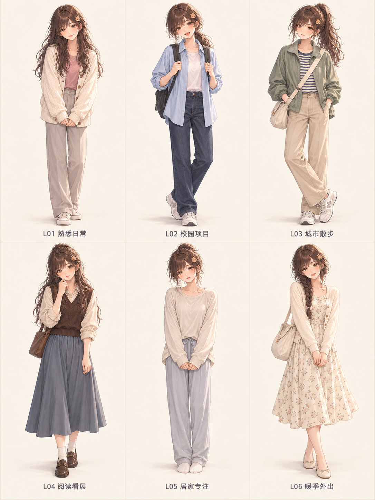
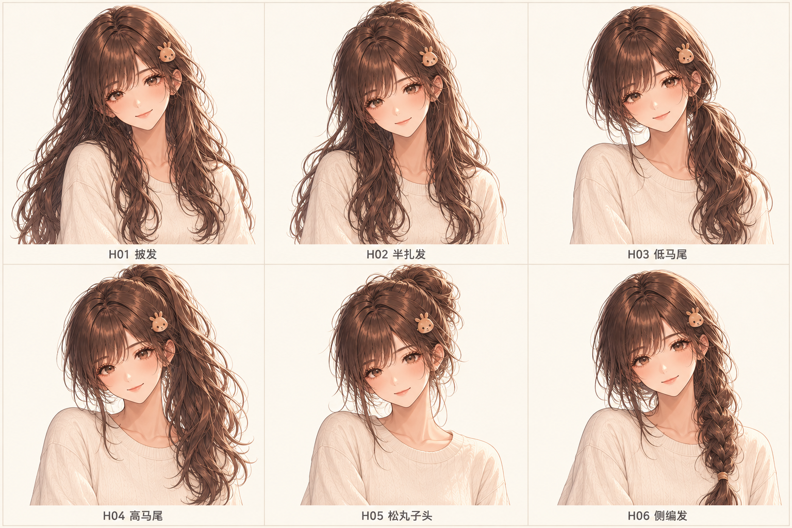

# 鹿芽衣服与发型 · 第一批审阅图

2026-10-05。用户同意按[形象方案](../appearance-plan-v1.md)出图，使用内置image_gen，参照现有main、headshot和life-focus。新增两张完整对照板，未替换原素材或接入应用。

## 六套完整造型

从左到右、从上到下：L01熟悉日常、L02校园项目、L03城市散步、L04阅读看展、L05居家专注、L06暖季外出。原图1086×1448。

## 六种发型

从左到右、从上到下：H01披发、H02半扎发、H03低马尾、H04高马尾、H05松丸子头、H06侧编发。原图1536×1024。

## 核对与用途

- 已查看两张生成图：各有六种方案，编号／中文标签可读；造型图头脚完整，发型图可分辨六种扎发轮廓。
- 与参考对照棕眼、栗棕发色、小鹿夹、脸型和漫画画法。人物一致性为人工视觉审阅，不代表用户已确认成图。
- 本批为浅底、带标注的审阅板。不能当成六张独立透明素材直接叠加房间；头像、站坐姿和场景图尚未制作。
- 原60张应用素材SHA-256全部保持一致；详见`assets-before.json`与[manifest.json](manifest.json)。本轮没有应用代码或存储变更，没有执行应用回归或真机验收。
- 完整提示词、三张参考路径、生成原文件路径保存在[prompts.json](prompts.json)。项目内PNG与生成原文件内容一致。

后续选择可直接用L01–L06、H01–H06编号提出。独立成品保留同一参考脸，再逐张制作和检查。
